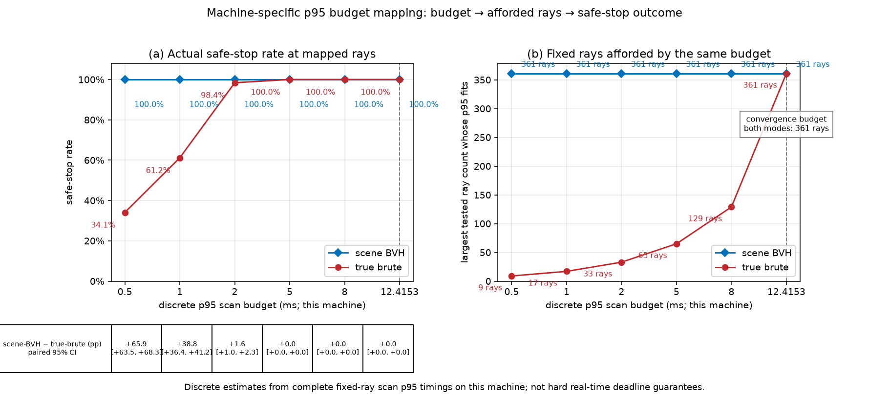
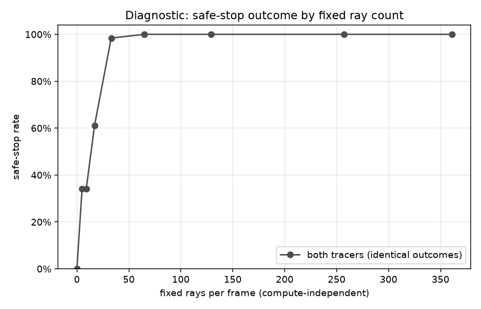
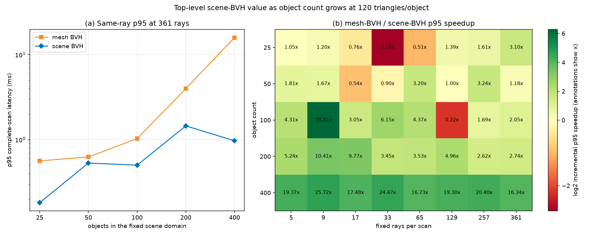
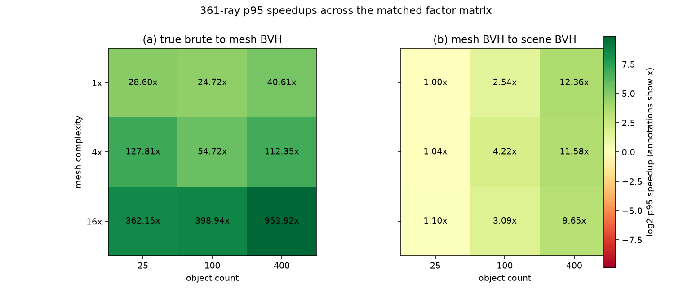
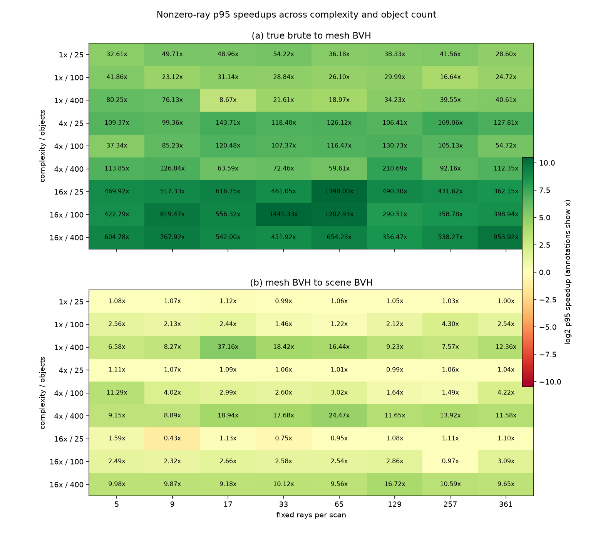
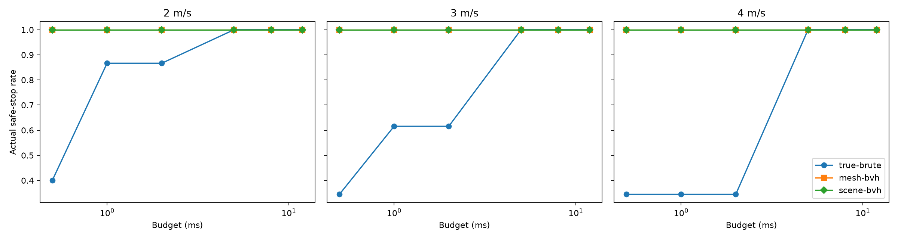
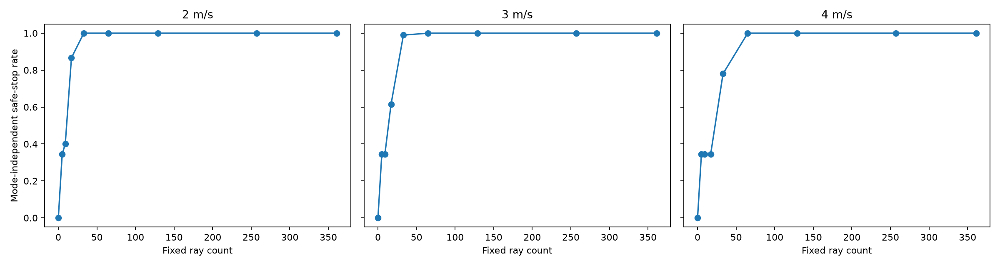

# 3D LiDAR Simulator

This project compares triangle-soup, per-mesh BVH, and scene-BVH ray tracing for
simulated LiDAR.
It publishes two controlled benchmarks:

1. **Layer 1 scaling:** fixed-ray latency as obstacle count grows.
2. **Hazard benchmark:** a straight-road vehicle detects one cylindrical hazard
   and brakes; fixed, nested ray counts measure detection and safe-stop outcomes.

The hazard experiment is deliberately narrow: it does not establish behavior for
general road scenes, planners, or hard real-time systems.

## Build, Test, and Run

```bash
cmake -S . -B build
cmake --build build
ctest --test-dir build --output-on-failure
./build/lidar_tests
```

Run Layer 1 with:

```bash
./build/lidar_scaling
./.venv/bin/python tools/plot_results.py --build-dir build --out-dir plots
```

Generate and analyze the hazard results with:

```bash
./build/hazard_benchmark safety --csv plots/hazard_trials.csv
./build/hazard_benchmark timing --csv plots/hazard_timing.csv
./.venv/bin/python tools/analyze_hazard.py \
  --trials plots/hazard_trials.csv --timing plots/hazard_timing.csv \
  --out-dir plots/hazard_analysis
```

Generate the fixed-1x object-count extension separately with:

```bash
./build/hazard_benchmark object-count-timing \
  --csv plots/hazard_object_count_timing.csv
./.venv/bin/python tools/analyze_object_count.py \
  --trials plots/hazard_trials.csv \
  --timing plots/hazard_object_count_timing.csv \
  --out-dir plots/hazard_object_count_analysis
```

Generate the matched complexity-by-object-count matrix separately with:

```bash
./build/hazard_benchmark complexity-object-count-timing \
  --csv plots/hazard_complexity_object_count_timing.csv
./.venv/bin/python tools/analyze_complexity_object_count.py \
  --trials plots/hazard_trials.csv \
  --timing plots/hazard_complexity_object_count_timing.csv \
  --out-dir plots/hazard_complexity_object_count_analysis
```

Generate the speed-only safety extension without rerunning timing:

```bash
./build/hazard_benchmark speed-safety \
  --csv plots/hazard_speed_trials.csv
.venv/bin/python tools/analyze_hazard_speed.py \
  --trials plots/hazard_speed_trials.csv \
  --timing plots/hazard_timing.csv \
  --out-dir plots/hazard_speed_analysis
```

`hazard_trials.csv` has every fixed-ray scenario outcome. `hazard_timing.csv`
has 81 median/p95 rows for 3 geometry-preserving mesh complexities, 3 tracer
modes, and 9 ray counts. The analyzer writes safety summaries, paired
differences, complexity-keyed timing and budget attribution, a robustness
summary, and acceptance gates under `plots/hazard_analysis/`. Use `python3` in
place of `.venv/bin/python` when no project virtual environment is available.
The object-count extension writes a separate 135-row timing CSV and separate
analysis directory; it does not regenerate either prior publication.
The matched matrix likewise writes a separate 243-row timing CSV and analysis
directory, reusing the fixed-ray safety trials once without joining timing values
from either separate sweep.
The speed extension writes a separate 86,400-row safety CSV and analysis
directory. It reuses only the published `1x`, 100-object timing slice and does
not invoke a timing command or combine speed with a matrix cell.

## Published Results

### Layer 1 latency


At 3,200 obstacles, scene-BVH is roughly **224x cheaper per ray** and grows much
more slowly with scene size than the linear scan.

### Geometry-preserving mesh-complexity robustness


The extension uniformly subdivides each existing timing triangle without
changing the represented surface: **120, 480, and 1,920 triangles per mesh**
(`1x`, `4x`, `16x`). All levels retain the same 100 objects, bounds, object IDs,
poses, ray layouts, warmups, and measurements. The safety experiment is not
rerun or multiplied by complexity; every timing series maps onto the existing
mode-independent fixed-ray safety curve.

**Measured answer: yes.** Mesh-BVH p95 is lower than true-brute at every nonzero
tested ray count in all three levels. At 361 rays, true-brute -> mesh-BVH ->
scene-BVH p95 is **10.828 -> 0.394 -> 0.154 ms** at `1x`,
**44.019 -> 0.427 -> 0.168 ms** at `4x`, and
**185.844 -> 0.508 -> 0.200 ms** at `16x`. The measured per-mesh BVH speedup is
therefore **27.5x, 103.2x, and 365.8x** respectively. From `1x` to `16x`,
true-brute p95 grows **17.16x**, while mesh-BVH and scene-BVH p95 grow only
**1.29x** and **1.30x**.

At the predeclared 0.5 ms budget, true-brute -> mesh-BVH -> scene-BVH maps to
**9 -> 361 -> 361 rays** at `1x`, **0 -> 361 -> 361** at `4x`, and
**0 -> 257 -> 361** at `16x`; the same fixed-ray curve maps those to
**34.1% -> 100.0% -> 100.0%**, **0.0% -> 100.0% -> 100.0%**, and
**0.0% -> 100.0% -> 100.0%** safe stops. All declared budgets and
per-complexity convergence results are in
[`hazard_budget_mapping.csv`](plots/hazard_analysis/hazard_budget_mapping.csv);
the complete robustness result is in
[`hazard_complexity_robustness.csv`](plots/hazard_analysis/hazard_complexity_robustness.csv).
The companion
[`hazard_complexity_robustness_exceptions.csv`](plots/hazard_analysis/hazard_complexity_robustness_exceptions.csv)
is header-only for this `YES` run; a `NO` run lists every failing complexity,
ray count, and p95 pair there.
One measured p95 inversion is reported rather than smoothed away: `1x`
true-brute decreases from **5.358 ms at 65 rays** to **4.823 ms at 129 rays**.
The predeclared mapping still selects the largest individually measured ray
count whose p95 fits, so the 5 ms row should be read as a discrete noisy
estimate, not a monotonic capacity curve; see
[`hazard_timing_inversions.csv`](plots/hazard_analysis/hazard_timing_inversions.csv).
These are machine-specific p95 estimates, not hard real-time guarantees. All
experiment-integrity gates pass; see
[`hazard_acceptance_gates.csv`](plots/hazard_analysis/hazard_acceptance_gates.csv).

#### Fixed-ray safety diagnostic


This secondary curve isolates the safety effect of ray count from compute cost.
Only one curve is shown because all three tracers produce identical outcomes
when given the same fixed rays.

### Scene-BVH value versus object count at fixed mesh complexity


This extension changes only object count through **25, 50, 100, 200, and 400**.
Every object uses the existing `1x` 120-triangle mesh. Scenes are deterministic,
nested subsets over one fixed spatial domain. Selected PR 2 objects are
instantiated in their original row-major order, so the 100-object level preserves
PR 2's exact specification sequence. Poses, ray layouts, tracer definitions, 20
warmups, 200 measurements, and construction exclusions are unchanged.

The measured 361-ray mesh-BVH -> scene-BVH p95 values are **0.393 -> 0.408 ms
(0.96x)** at 25 objects, **1.102 -> 0.439 ms (2.51x)** at 50,
**1.503 -> 0.512 ms (2.94x)** at 100, **1.126 -> 0.350 ms (3.22x)** at 200,
and **3.179 -> 0.404 ms (7.86x)** at 400. This is not a monotonic-latency or
speedup claim. Scene-BVH had 3 adverse nonzero-ray p95 comparisons at 25 objects
and 1 at 50; it improved every nonzero-ray comparison at 100, 200, and 400.

At the 0.5 ms budget, mesh-BVH -> scene-BVH maps **361 -> 361**, **129 -> 361**,
**65 -> 257**, **129 -> 361**, and **65 -> 361 rays** at
25/50/100/200/400 objects. The corresponding ray gains are
**0, 232, 192, 232, and 296**. Every mapped pair is already on the unchanged
fixed-ray curve's 100% safe-stop plateau, so this measured run has **zero
safe-stop gain at every standard budget and object count**.

The publication retains all 4 mesh-to-scene adverse comparisons, 4 adjacent-ray
p95 decreases, and 24 adjacent-count p95 decreases rather than smoothing them;
see
[`hazard_object_count_robustness_exceptions.csv`](plots/hazard_object_count_analysis/hazard_object_count_robustness_exceptions.csv)
and
[`hazard_object_count_timing_inversions.csv`](plots/hazard_object_count_analysis/hazard_object_count_timing_inversions.csv).
Detailed timing and budget attribution are in the same directory. These remain
machine-specific p95 estimates, not hard real-time guarantees.

### Joint mesh-complexity and object-count interactions


This matched extension measures all **nine** `1x/4x/16x × 25/100/400` cells in
one fresh timing batch. It retains the exact coplanar mesh subdivision,
deterministic nested fixed-domain scenes, 32 poses/layouts, three tracers, nine
ray counts, 20 warmups, and 200 measurements. It reuses the unchanged safety
trials once and does not join timing values from either separate sweep.

**Measured answer: joint interactions change only the scene-level conclusion.**
Mesh-BVH p95 remains lower than true-brute at every nonzero ray count in all nine
cells. Scene-BVH remains lower than mesh-BVH at every nonzero ray count in five
cells: every 100/400-object cell except `16x/100`. It is mixed at all three
25-object cells and at `16x/100`, with six adverse comparisons total. The
exceptions are `1x/25` at 33 rays, `4x/25` at 129, `16x/25` at 9/33/65, and
`16x/100` at 257. Thus per-mesh acceleration is robust to the joint factors;
scene-level acceleration is strongly beneficial at moderate/high counts but its
overhead can erase the gain in low-count or isolated noisy corners.

At 361 rays, true-brute → mesh-BVH → scene-BVH p95 ranges from
**5.997 → 0.210 → 0.210 ms** at `1x/25` to
**3436.750 → 3.603 → 0.373 ms** at `16x/400`. Per-mesh speedup spans
**24.7x–953.9x** across cells at that ray count; incremental scene-level speedup
spans **1.00x–12.36x**. At 0.5 ms, scene-BVH maps to 361 rays in every cell,
while mesh-BVH maps to 9–361 and true-brute to 0–9, depending on the factors.

The publication retains all **10 ray-axis, 40 complexity-axis, and 14
object-count-axis** adjacent p95 decreases. Detailed values, all six adverse
comparisons, per-cell convergence, and every gate are in
[`plots/hazard_complexity_object_count_analysis/`](plots/hazard_complexity_object_count_analysis/).
These are descriptive machine-specific p95 estimates, not a fitted interaction
model or hard real-time guarantees.

#### All nonzero ray counts


This secondary diagnostic retains every nonzero-ray comparison; the primary
figure above is the readable 361-ray factor matrix.

### Safe stopping across vehicle speed



This extension changes vehicle speed only, using exactly **2, 3, and 4 m/s**.
The paired comparison predeclares one common domain with 4 m and 8 m
front-bumper clearances, three hazard diameters, five offsets, and 32 phases:
**960 tuples per speed and 2,880 globally unique scenarios**. The 2 m clearance
is excluded because at 4 m/s the 2 m stopping distance reaches contact exactly;
collision precedence makes that first-frame control invalid. The original 3 m/s
publication retains all three clearances unchanged.

**Measured answer: yes, within this common domain.** The existing `1x`,
100-object p95 timing slice maps the 0.5/1/2/5/8 ms budgets to
**9/17/17/129/129 rays** for true-brute and **361 rays at every budget** for
both accelerated modes. That mapping is computed once and reused identically
across speeds.

At 0.5 ms, true-brute safe-stop rates at 2/3/4 m/s are
**40.1% / 34.5% / 34.5%**, versus **100% / 100% / 100%** for mesh-BVH and
scene-BVH: gains of **59.9 / 65.5 / 65.5 percentage points**. At both 1 and
2 ms, the gains widen from **13.3** to **38.4** to **65.5 points** as speed
rises. The per-mesh acceleration safety advantage therefore persists and
widens at the tighter 1-2 ms budgets; it disappears at 5 and 8 ms only because
all modes are already on the 100% safe-stop plateau. No reversal occurs.
Mesh-BVH and scene-BVH have equal safe-stop outcomes because both map to 361
rays, although their reused scan timings remain different.

All speeds have 100% zero-ray collisions and 100% first-frame and 361-ray safe
stops. Fixed-ray safe-stop rate and all-scenario mean unbraked TTC are
non-decreasing at each speed, and all three tracers preserve hit, object-ID, and
range parity. Exact rates, paired confidence intervals, collision speeds,
undetected collisions, classifications, and gates are in
[`plots/hazard_speed_analysis/`](plots/hazard_speed_analysis/).

#### Fixed-ray speed diagnostic



Each facet contains one curve because tracer outcomes are identical for a fixed
layout. This controlled result does not cover 2 m clearance across speed,
dynamic hazards, steering, planning, live deadlines, or general road realism.
