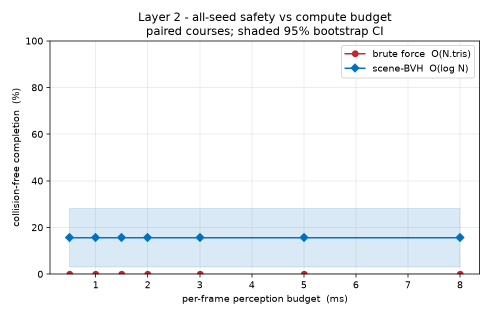
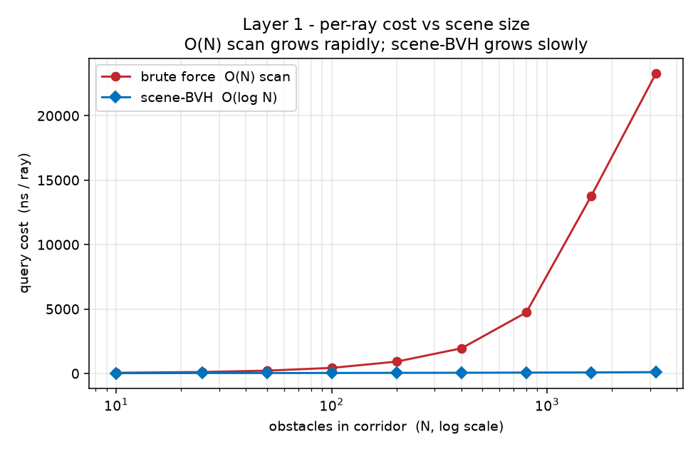

# 3D LiDAR Simulator

After learning about ray tracing in computer graphics, particularly acceleration data structures (BVHs),
I was curious whether applying the same optimization to LiDAR sensors could make an 
autonomous vehicle measurably safer under time constraint, given their underlying similarities.  

**Scenario:** A car running basic follow-the-gap obstacle avoidance drives down a corridor 
with randomized pillar spawns, scanning with a simulated, ray-traced 3D LiDAR. We will measure 
how many rays each mode (brute force vs. acceleration) can afford under a fixed, per-frame compute budget.

## Comparison

We compare across 2 verticals:

**1. Latency vs. scene size:** Trace a fixed ray set
against a corridor of `N` obstacles and measure nanosec/ray as `N` grows. A brute force
`O(N)` scene walk climbs linearly; the scene-BVH `O(log N)` grows much more slowly. Every
BVH result is correctness-gated against the linear scan (0 mismatches).

**2. Autonomy at a budget:** Give each frame a fixed compute budget (e.g. 0.5 ms).
Each mode traces progressive rays with its real implementation until the live
deadline. Only completed rays reach the planner; the crossing ray is discarded
and its execution overrun is recorded. Under severe constraint,
brute force cannot generate a clear picture fast enough and crashes more, while BVH always affords full angular
resolution. The primary metric is collision-free course completion over every
paired seed; reach, progress, first-collision distance, and collisions per 100 m
are reported as secondary outcomes.

### Cost Model

Brute force tests every triangle; BVH uses bounding boxes to skip empty regions.
Layer 2 measures p95 full-scan cost for diagnostics, but live elapsed time—not
the model—determines the completed ray count each frame. Results report both
the p95-predicted `K` and the actual average/range so model error is visible.
The baked `CostModel` remains for the standalone validation tool.

### Deadline Contract

The deadline-driven benchmark uses this contract:

- Frames remain fixed at 30 Hz; the perception budget covers scanning only.
- A frame's scan deadline is `scan_start + budget_ms`.
- A ray is usable only if it completes on or before that deadline.
- The first ray that completes late is discarded. Its execution overrun is
  recorded, but it cannot alter the planner's deadline snapshot.
- Rays follow a deterministic center/edges/largest-gap order on the fixed
  361-angle grid, so every prefix of at least three rays spans the full field
  of view without left-to-right bias.
- Each angular bin distinguishes observed-hit, observed-clear, and unobserved.
  Unrefreshed observations remain usable for at most three frames (100 ms);
  older and never-observed bins are treated as blocked.
- The first frame therefore treats every angle as blocked until observed.
- The 361-ray sensor-resolution cap remains in force.

This is a hard deadline for planner-visible data, not thread preemption: one
in-flight ray may execute past the cutoff, but its result is never consumed.

### Collision Semantics

Pillar contact uses the oriented vehicle rectangle against each pillar's
intended circular cross-section. The full motion between consecutive poses is
checked with 1 cm tolerance-bounded subdivision, preventing small obstacles
from being skipped between frames. Swept vehicle contact with either corridor
wall terminates the run as a failure.

## Build & Run

```bash
cmake -S . -B build
cmake --build build
```

Then:

```bash
./build/lidar_tests
./build/lidar_scaling         # Latency/scaling comparison
./build/calibrate             # refit the cost model (prints R²)
./build/validate_cost_model   # validate modeled K against timed real tracers
./build/layer2_benchmark
```

`validate_cost_model` times the real triangle-soup and scene-BVH query paths on
identical Layer 2 worlds, poses, and ray directions. It reports the modeled ray
count, a conservative measured-throughput estimate, p95 scan time, and deadline
miss rate for each budget. World construction, ray generation, and planning are
excluded because the baked model represents intersection-query cost only.

For `validate_cost_model`, use `--seeds`, `--poses`, and `--repeats` to control
the sample size, or `--csv` for machine-readable output.

## Plots

A small Python script to generate plots:

```bash
python3 -m venv .venv
./.venv/bin/pip install matplotlib
./.venv/bin/python tools/plot_results.py            # default 32 seeds -> plots/
./.venv/bin/python tools/plot_results.py --no-run   # replot saved CSVs
```  

The default 32-seed run performs real deadline-limited brute-force tracing and
can take up to roughly one hour. Progress is written to stderr. Aggregate and
per-seed CSVs are tracked with the plots so the published figures are reproducible.

### Crash Safety 


The safety plot reports collision-free completion over all 32 paired seeds with
bootstrap confidence intervals. No failed, stuck, or wall-contact run is removed.
Per-seed outcomes are saved to `plots/layer2_trials.csv`.

At 0.5 ms, scene-BVH completes **5/32 courses collision-free (15.6%)** versus
**0/32 for brute force**: a paired difference of **+15.6 percentage points**
with a 95% bootstrap CI of **[+3.1, +28.1]**. Overall reach is still low
(10/32 for scene-BVH and 0/32 for brute force), and the same success rates
persist across the tested budgets. This indicates a controller/sparse-observation
limit in addition to the ray-tracing performance gap.

### Ray Latency  


At 3,200 obstacles, scene-BVH is roughly **274x cheaper per ray** and grows much
more slowly with scene size than the linear scan.