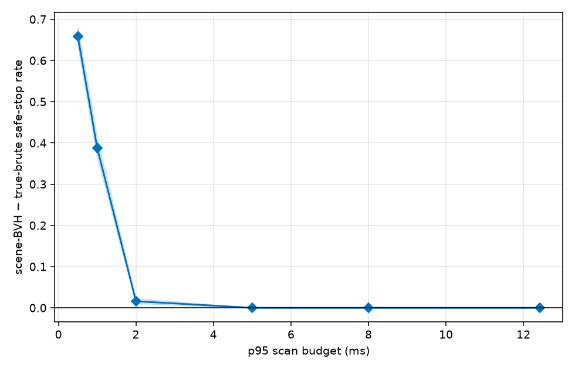

# 3D LiDAR Simulator

This project compares brute-force and scene-BVH ray tracing for simulated LiDAR.
It publishes two controlled benchmarks:

1. **Layer 1 scaling:** fixed-ray latency as obstacle count grows.
2. **Hazard benchmark:** a straight-road vehicle detects one cylindrical hazard
   and brakes; fixed, nested ray counts measure detection and safe-stop outcomes.

The hazard experiment is deliberately narrow: it does not establish behavior for
general road scenes, planners, or hard real-time systems.

## Build, Test, and Run

```bash
cmake -S . -B build
cmake --build build
ctest --test-dir build --output-on-failure
./build/lidar_tests
```

Run Layer 1 with:

```bash
./build/lidar_scaling
./.venv/bin/python tools/plot_results.py --build-dir build --out-dir plots
```

Generate and analyze the hazard results with:

```bash
./build/hazard_benchmark safety --csv plots/hazard_trials.csv
./build/hazard_benchmark timing --csv plots/hazard_timing.csv
./.venv/bin/python tools/analyze_hazard.py \
  --trials plots/hazard_trials.csv --timing plots/hazard_timing.csv \
  --out-dir plots/hazard_analysis
```

`hazard_trials.csv` has every fixed-ray scenario outcome; `hazard_timing.csv`
has median and p95 scan timing. The analyzer writes summary, paired-difference,
budget-mapping, and acceptance-gate tables plus plots under
`plots/hazard_analysis/`. Use `python3` in place of `.venv/bin/python` when no
project virtual environment is available.

## Published Results

### Layer 1 latency


At 3,200 obstacles, scene-BVH is roughly **224x cheaper per ray** and grows much
more slowly with scene size than the linear scan.

### Hazard safety and budget mapping



The published controlled experiment contains 1,440 deterministic scenarios per
mode and ray count. At the 0.5 ms p95 mapping on this machine, scene-BVH maps to
361 rays and true-brute to 9 rays; safe-stop rates are **100.0%** and **34.1%**
(paired difference **+65.9 percentage points**, 95% CI **[+63.5, +68.3]**).
All acceptance gates pass; see
[`hazard_acceptance_gates.csv`](plots/hazard_analysis/hazard_acceptance_gates.csv).

Budget mapping is a machine-specific p95 estimate from complete fixed-ray scans,
not a hard real-time guarantee.
